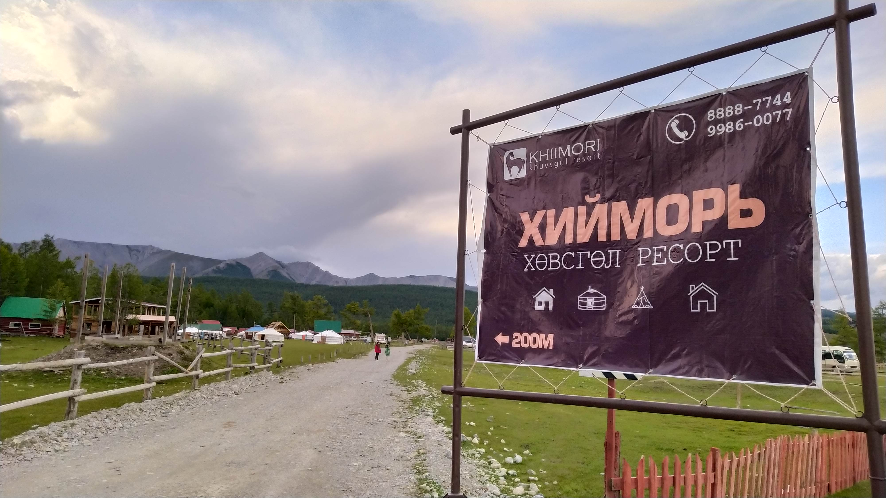
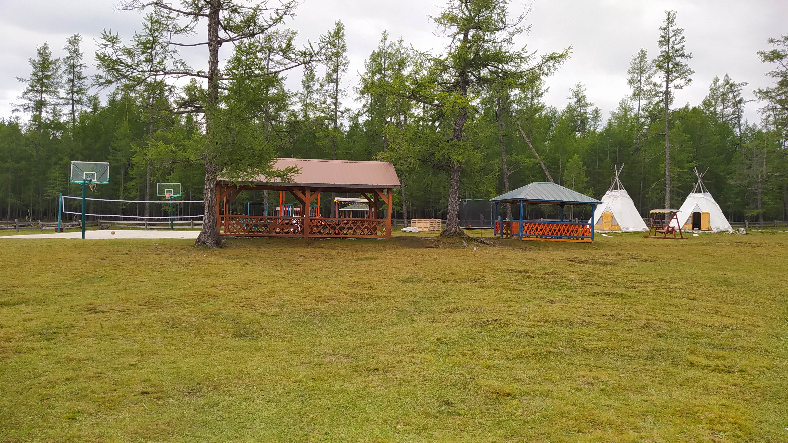
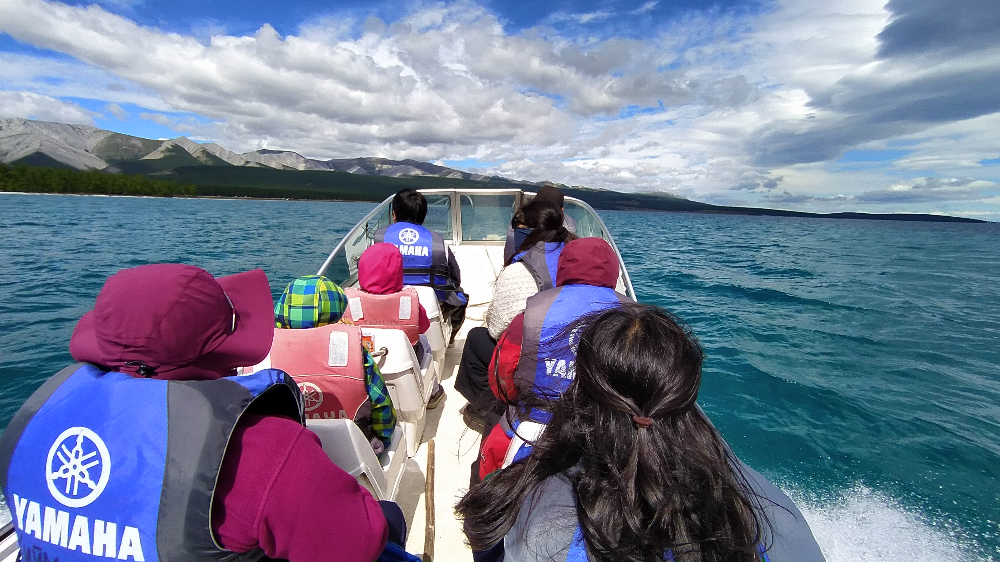
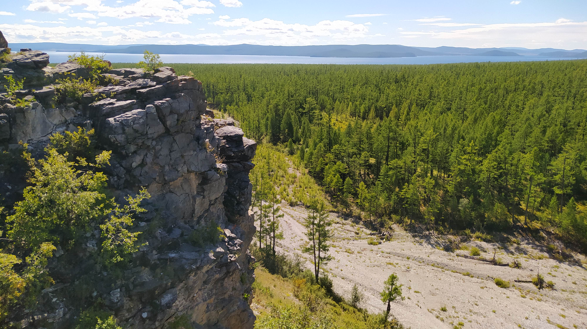

# Хөвсгөл нуур - Хийморь ресорт (Hiimori resort at Huvsgul lake)

## Хийморь ресорт

Хөвсгөл нуурын баруун эрэгт, Жанхайн давааны ард байрлах "Хийморь" ресортод 3 хоног амарч, өдрийн янз бүрийн аялалууд хийв.
"Хийморь" ресорт нь 2016 оноос хойш амрагчдад тогтмол үйлчилж байгаа.
Нуурын эргээс холгүй, 5 мин алхаад хүрэх зайд, ойн захад байрлана.

Өдрийн 3 удаагийн хоолоор үйлчлэх хоолны газартай, мөн битүү террастай.
Амрагчдыг мини хауз, шовгор сууц, гэр, урцанд байрлуулна.
Угаалтуур, суултуур, шүршүүр, угаалгын машин зэргээр тоноглосон нийтийн ариун цэврийн газартай.
Сагс, волейбол, ширээний теннис зэрэг спорт талбайнуудаас гадна хүүхдийн тоглоомын талбайтай.

Амралтын үнэ тарифыг сонирхуулбал (2023 оны 8 сарын 18-ны байдлаар 30К төг-ний хямдралтай байв):

| Сууц | Багтаамж  | Том хүн, төг | Хүүхэд, төг |
| --- | --- | --- | --- |
| Мини хауз | 2 өргөн ор, 1 суудлын диван | 150К | 80К |
| Шовгор | 4 ор | 100К | - |
| Гэр | 5 ор | 100К | 70К |

Эдгээр үнэ хоолны үнийг багтаасан болно.

Өдрийн дараахь аялалуудыг ресортын зүгээс санал болгоно:
- морин аялал: 20К/цаг
- Хүслийн хадны завин аялал: 2 цаг, 30К/хүн, 20К/хүүхэд
- Модон хүй эсвэл Хадан хүй арлын завин аялал: 4-5 цаг, 600К/завь
- зүүн талын эрэгт зусах цаатан айлаар зочлох

Түүнээс гадна 2 хүний каяак завийг 10К төг/хүн хөлсөөр түрээслэн, эргийн усанд тоглож болно.

Мөн ресортоос 5 км орчим зайд байрлах хадан цохиотой өндөрлөгт гарч, байгалийн зураглал хийх боломжтой.
Хадан цохио уруу:
- машинаар шууд эсвэл дөхөж очоод явганаар
- мориор
- эсвэл шууд явганаар хүрч очих бүрэн боломжтой.

## Замд

Улаанбаатараас "Хийморь" ресорт хүрэх автомашины аялалыг дараахь маршрутаар хийсэн болно.
1. УБ -> Уньтын рашаан: 500 км орчим замыг УБ - Дархан - Эрдэнэт - Булган - Уньт гэсэн чиглэлд бүтэн өдөр явж, Уньтын рашаан дээр хоноглоно.
2. Уньтын рашаан -> Хийморь: 450 км орчим замыг Хутаг-Өндөр - Их-Уул - Тосонцэнгэл - Мөрөн - Алаг-Эрдэнэ - Хатгал гэсэн чиглэл бас бүтэн өдөр явна.

Буцахдаа энэ маршрутаар буцсан болно. Хатгалаас "Хийморь" ресорт хүрэх сүүлийн 24 км хэсгээс бусад нь засмал замаар явна.
Жанхайн давааны шороон, сайжруулсан зам засвартай байснаас сүүлийн 24 км замыг бараг 1 цаг гаран явсан.
Ингээд 2 талдаа нийтдээ 4 хоног нь замд өнгөрнө. Уньтын рашаан дээр хооллох, хоноглох боломжтой.

Аялалд Toyota Hiace, Hyundai Starex зэрэг 5 суудалтай, хагас ачааны машинуудыг ашигласан.

## Аялалын зардал

Аялалын зардлыг тоймловол (5 хүн):
- Хийморь ресорт:
   - байр, хоол: 1410К
   - аялал, бусад: 300К
- Уньтын рашаан:
   - байр: 100К + 50K
- замын хүнс, хоол: 300К
- замын хураамж: 20К (15К нь тусгай хамгаалалттай газарын хураамж)
- дизел түлш: 156,5 л, 514К төг (үнэ 3490 төг/л дундаж, 3100 төг/л мин, 3650 төг/л макс)

## Анхаарах зүйлс

Хөвсгөл далайн амралтын цаг агаарын хамгийн таатай үе нь 7 сарын 25-аас 8 сарын 15 хооронд байна.
Энэ үед үнэ тариф бас хамгийн өндөр байна.
Ажлын өдрүүдээр амрагч цөөн байх тул энэ өдрүүдийг тааруулж ирэх хэрэгтэй.
Мини хауз нь өөрийн шүршүүр, угаалтуур, суултууртай, мөн шалны халаалттай.
Харин гэр, шовгор байранд байх бол халаагуур, газын асаагуур, угаарын мэдрэгч зэргийг базаах хэрэгтэй.
Дор хаяж 7 хоногийг аялалд төлөвлөнө, хээр отоглох бол хээрийн бэлтгэл нэмэгдэнэ (майхан, аяны хөнжил, гудас, гал тогоо г.м).
Уньтын рашаан нь замын дунд отоглох хамгийн тохиромжтой цэг, тэнд бэлэн байранд хоноглохоос гадна өөрсдийн майханд отоглох боломжтой.
Мөн хоолны газар нь хоол сайтай, 9-21 цагийн хооронд ажиллана.

Харанхуйд замд явахгүй байх!
- замын зураасан тэмдэг бараг харагдахгүй
- зам дээр амьтан, машин, нүх гээд элдэв саад гэнэт таарна
- эсрэг урсгалын машинууд холын гэрлээ тэр бүр шилжүүлэхгүй тул нүд аймшигтай гялбана, ядарна

## Холбоосууд

"Хийморь" ресорт, [Facebook хуудас](https://www.facebook.com/Khiimoriresortkhuvsgul/)

Хөвсгөл далай хүрэх маршрут, [ikon.mn](https://ikon.mn/n/sfm)
